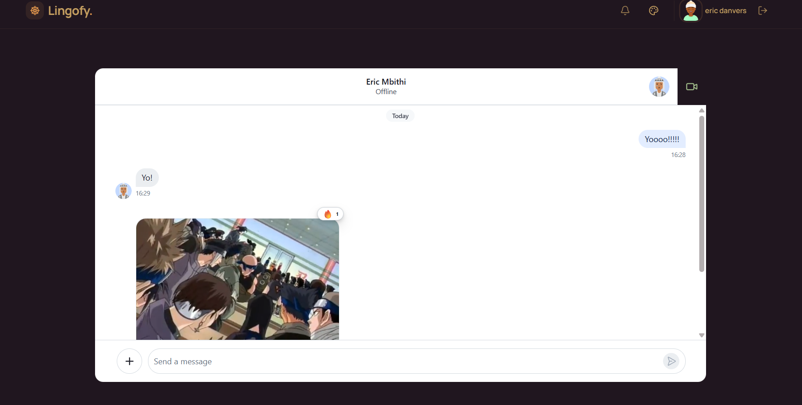
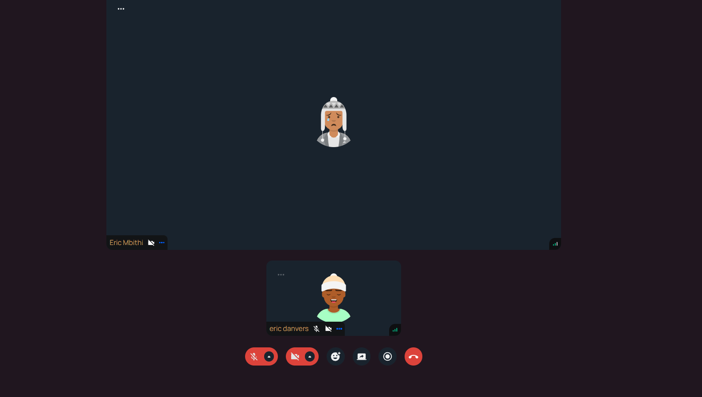
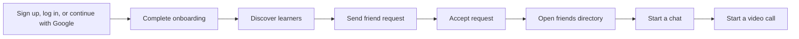

<div align="center">

# Lingofy

### Language practice that feels like a conversation, not a classroom.

Connect with language learners, build real friendships, chat in real time, and jump into a video call when text is not enough.

[**Live demo**](https://lingofy-1.onrender.com/)


</div>

## What is Lingofy?

Lingofy is a social language-learning app for finding conversation partners and practicing together. It combines discovery, friend requests, messaging, and video calls in one focused experience.

## Product Tour

| Discover | Connect | Practice |
| --- | --- | --- |
| Find language partners through recommendations and profile details. | Send and accept friend requests to build your own circle. | Message friends in real time and start a video call from the chat. |

## Screenshots

| Real-time chat | Video calls |
| --- | --- |
|  |  |

## Highlights

- **Language partner discovery** with native and learning language matching.
- **Friend network** with incoming requests, accepted connections, and a dedicated friends directory.
- **Real-time chat** powered by Stream Chat.
- **Video calling** powered by Stream Video SDK.
- **Google sign-in** alongside email and password, with automatic account linking.
- **Onboarding flow** for completing a learner profile before entering the app.
- **Responsive interface** with theme support and mobile-friendly layouts.
- **Protected sessions** using JWT authentication, HTTP-only cookies, and authenticated API routes.
- **Hardened API** with rate-limited auth routes, security headers, and a strict allow-list of public user fields.

## Tech Stack

| Layer | Tools |
| --- | --- |
| Frontend | React 19, Vite, React Router, TanStack Query, Tailwind CSS, daisyUI |
| Communication | Stream Chat React, Stream Video React SDK |
| Backend | Node.js, Express 5, MongoDB, Mongoose |
| Authentication | JWT, HTTP-only cookies, bcrypt, Google Identity Services (`@react-oauth/google`, `google-auth-library`) |
| Security | helmet, express-rate-limit, CORS allow-list |
| UI | Lucide React, React Hot Toast, Zustand |

## Project Structure

```
Lingofy/
├── backend/
│   └── src/
│       ├── controllers/    # Auth, users, and chat handlers
│       ├── lib/            # Database and Stream helpers
│       ├── middleware/     # Authentication middleware
│       ├── models/         # User and friend request models
│       └── routes/         # API route definitions
├── frontend/
│   └── src/
│       ├── components/     # Shared UI, chat controls, Google sign-in button
│       ├── hooks/          # Auth and mutation hooks
│       ├── pages/          # App screens and workflows
│       ├── lib/            # API client and utilities
│       └── store/          # Client-side theme state
└── package.json            # Root build and start commands
```

## Run Locally

### 1. Install dependencies

```bash
npm install --prefix backend
npm install --prefix frontend
```

### 2. Set up Google sign-in

Lingofy uses Google Identity Services. You need a Google OAuth Client ID:

1. In the [Google Cloud Console](https://console.cloud.google.com), create a project and configure the OAuth consent screen.
2. Go to **Credentials**, then **Create Credentials**, then **OAuth client ID**, and choose **Web application**.
3. Under **Authorized JavaScript origins**, add:
   - `http://localhost:5173`
   - `http://localhost`
   - your production URL, for example `https://lingofy-1.onrender.com`
4. Leave **Authorized redirect URIs** empty. The ID-token flow does not use them.
5. Copy the **Client ID**. The client secret is not needed.

> Open the app at `http://localhost:5173`, not `http://127.0.0.1:5173`. Google treats them as different origins and will reject sign-in with an `origin_mismatch` error. While the consent screen is in **Testing** mode, only accounts listed as test users can sign in.

### 3. Configure environment variables

Create `backend/.env`:

```env
PORT=3000
NODE_ENV=development
MONGO_URI=your_mongodb_connection_string
JWT_SECRET_KEY=your_jwt_secret
STREAM_API_KEY=your_stream_api_key
STREAM_API_SECRET=your_stream_api_secret
GOOGLE_CLIENT_ID=your_client_id.apps.googleusercontent.com
```

Create `frontend/.env`:

```env
VITE_STREAM_API_KEY=your_stream_api_key
VITE_API_URL=http://localhost:3000/api
VITE_GOOGLE_CLIENT_ID=your_client_id.apps.googleusercontent.com
```

Never commit real secrets. The Stream API key and the Google Client ID are safe to expose to the browser, but the Stream API secret, MongoDB URI, and JWT secret must remain server-side. Vite and Node only read `.env` files at startup, so restart both servers after changing them.

### 4. Start the backend

```bash
npm start
```

The API runs on `http://localhost:3000`.

### 5. Start the frontend

```bash
npm run dev --prefix frontend
```

The Vite app runs on `http://localhost:5173`.

## Production Build

The root build command installs both packages and creates the frontend bundle expected by the Express production server:

```bash
npm run build
npm start
```

When deploying (for example on Render), set `NODE_ENV=production` and all the variables from the sections above. `VITE_` variables are baked into the frontend bundle at **build time**, so they must be set before the build runs, and changing one requires a redeploy.

## Application Flow



## Authentication

Lingofy supports email and password as well as Google sign-in. Both end the same way: the server sets an HTTP-only JWT cookie, so the rest of the app does not care how a user signed in.

### How Google sign-in works

1. The browser shows the Google button and receives a signed ID token from Google.
2. The token is sent to `POST /api/auth/google`.
3. The server verifies the token's signature, expiry, and audience (this app's Client ID) with `google-auth-library`, and requires a verified email.
4. The user is found or created, a Stream user is created for new accounts, and the session cookie is set.

### Account linking

If someone signs in with Google using an email that already has an email and password account, Google is linked to that account and the old password is **removed**. Because email signup does not verify addresses, this prevents someone who pre-registered another person's email from keeping access after the real owner signs in with Google. The tradeoff is that the account can then only be accessed through Google. Signing in with a password on a Google-only account returns a message pointing the user to Google sign-in.

## Security

- **Sessions:** JWTs are stored in HTTP-only, `SameSite=Strict` cookies (`Secure` in production) and last 7 days. Expired or invalid tokens receive a `401`.
- **Passwords:** hashed with bcrypt and never returned by any endpoint.
- **Public data:** other users are only ever exposed through an explicit field allow-list (name, picture, bio, languages, location). Emails, password hashes, and Google IDs are never sent to other users.
- **Input handling:** onboarding updates only a fixed set of fields, and route parameters are validated before use.
- **Rate limiting:** signup, login, and Google sign-in are limited to 20 attempts per IP every 15 minutes.
- **Headers and CORS:** `helmet` security headers, a CORS allow-list with credentials, and a 10 KB JSON body limit.
- **Duplicates:** a unique database index prevents duplicate friend requests between the same pair of users.

## Notes for Contributors

- Keep API calls in `frontend/src/lib/api.js` and reuse the shared Axios client.
- Use the existing authenticated route pattern when adding pages.
- Keep Stream tokens generated on the backend and pass only user-scoped tokens to the client. The token endpoint must always use the user from the verified session, never an ID from the request.
- When returning other users' data, always select fields from the public allow-list in `user.controller.js` instead of returning whole documents.
- Run the frontend checks before opening a pull request:

```bash
npm run lint --prefix frontend
npm run build --prefix frontend
```

## License

Copyright (c) 2026 [Eric Mbithi](https://github.com/iiTzEric).

All rights reserved. No part of this project may be copied, modified, distributed, or used without permission from the copyright holder.