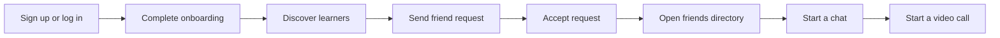

# Lingofy

<div align="center">

### Language practice that feels like a conversation, not a classroom.

Connect with language learners, build real friendships, chat in real time, and jump into a video call when text is not enough.

<a href="https://github.com/iiTzEric/Lingofy">View the repository</a>

<br />
<br />


</div>

## What is Lingofy?

Lingofy is a social language-learning app for finding conversation partners and practicing together. It combines discovery, friend requests, messaging, and video calls in one focused experience.

## Product Tour

| Discover                                                            | Connect                                                   | Practice                                                           |
| ------------------------------------------------------------------- | --------------------------------------------------------- | ------------------------------------------------------------------ |
| Find language partners through recommendations and profile details. | Send and accept friend requests to build your own circle. | Message friends in real time and start a video call from the chat. |

<div align="center">


</div>

## Highlights

- **Language partner discovery** with native and learning language matching.
- **Friend network** with incoming requests, accepted connections, and a dedicated friends directory.
- **Real-time chat** powered by Stream Chat.
- **Video calling** powered by Stream Video SDK.
- **Onboarding flow** for completing a learner profile before entering the app.
- **Responsive interface** with theme support and mobile-friendly layouts.
- **Protected sessions** using JWT authentication, cookies, and authenticated API routes.

## Tech Stack

| Layer          | Tools                                                               |
| -------------- | ------------------------------------------------------------------- |
| Frontend       | React 19, Vite, React Router, TanStack Query, Tailwind CSS, daisyUI |
| Communication  | Stream Chat React, Stream Video React SDK                           |
| Backend        | Node.js, Express 5, MongoDB, Mongoose                               |
| Authentication | JWT, HTTP-only cookies, bcrypt                                      |
| UI             | Lucide React, React Hot Toast, Zustand                              |

## Project Structure

```text
Lingofy/
├── backend/
│   └── src/
│       ├── controllers/    # Auth, users, and chat handlers
│       ├── lib/            # Database and Stream helpers
│       ├── middleware/     # Authentication middleware
│       ├── models/         # User and friend request models
│       └── routes/         # API route definitions
├── frontend/
│   └── src/
│       ├── components/     # Shared UI and chat controls
│       ├── hooks/          # Auth and mutation hooks
│       ├── pages/          # App screens and workflows
│       ├── lib/            # API client and utilities
│       └── store/          # Client-side theme state
└── package.json            # Root build and start commands
```

## Run Locally

### 1. Install dependencies

```bash
npm install --prefix backend
npm install --prefix frontend
```

### 2. Configure environment variables

Create `backend/.env`:

```dotenv
PORT=3000
NODE_ENV=development
MONGO_URI=your_mongodb_connection_string
JWT_SECRET_KEY=your_jwt_secret
STREAM_API_KEY=your_stream_api_key
STREAM_API_SECRET=your_stream_api_secret
```

Create `frontend/.env`:

```dotenv
VITE_STREAM_API_KEY=your_stream_api_key
VITE_API_URL=http://localhost:3000/api
```

Never commit real secrets. The Stream API key is safe to expose to the browser, but the Stream API secret, MongoDB URI, and JWT secret must remain server-side.

### 3. Start the backend

```bash
npm start
```

The API runs on `http://localhost:3000`.

### 4. Start the frontend

```bash
npm run dev --prefix frontend
```

The Vite app runs on `http://localhost:5173`.

## Production Build

The root build command installs both packages and creates the frontend bundle expected by the Express production server:

```bash
npm run build
npm start
```

## Application Flow



## Notes for Contributors

- Keep API calls in `frontend/src/lib/api.js` and reuse the shared Axios client.
- Use the existing authenticated route pattern when adding pages.
- Keep Stream tokens generated on the backend and pass only user-scoped tokens to the client.
- Run the frontend checks before opening a pull request:

```bash
npm run lint --prefix frontend
npm run build --prefix frontend
```

## License

Copyright (c) 2026 [Eric Mbithi](https://github.com/iiTzEric).

All rights reserved. No part of this project may be copied, modified, distributed, or used without permission from the copyright holder.
